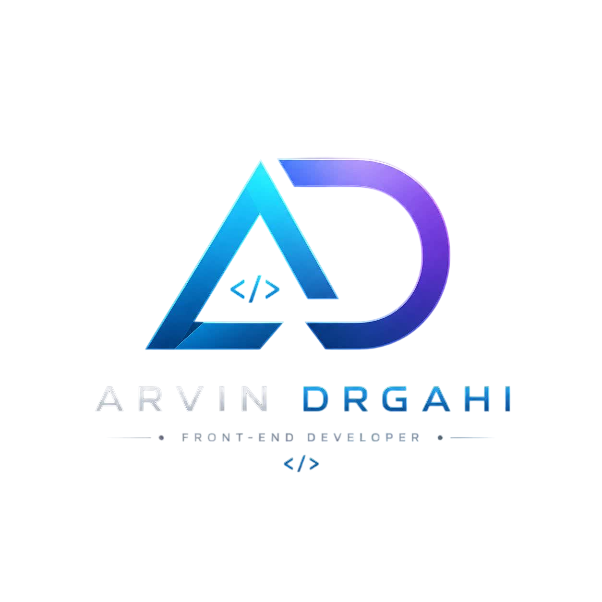

  

# 💫 About Me:
 
Computer Engineering student & Front-End Developer focused on 
   modern, responsive, and interactive web development.

## 🌐 Socials:
  

# 💻 Tech Stack:
   
# 📊 GitHub Stats:
 
 

